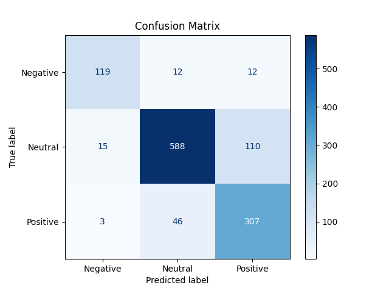

# Advanced-Sentiment-Analysis-Project

Sentiment analysis using PyTorch. Building upon my other repository regarding sentiment analysis on tweets about stocks, this project aims to test different neural networks and to teach myself PyTorch more in depth. 

## Table of Contents
1. [Related Work](#related-work)
2. [Dataset Source](#dataset-source)
3. [Goals](#goals)
4. [Project Files](#project-files)
    - [old/simple_nn.ipynb](#oldsimple_nn-ipynb)
    - [rnn_model_news_analysis.py](#rnn_model_news_analysis-py)
5. [Challenges in Sentiment Analysis](#challenges-in-sentiment-analysis)
6. [Learnings](#learnings)
    - [Model Selection](#model-selection)
    - [Performance Optimization](#performance-optimization)
    - [Tool Exploration](#tool-exploration)
7. [Model Predictions: Examples and Analysis](#model-predictions-examples-and-analysis)
    - [Examples](#examples)
    - [Observations](#observations)
    - [Insights on Context](#insights-on-context)
8. [Future Work Based on Observations](#future-work-based-on-observations)
9. [Feedback and Contributions](#feedback-and-contributions)

## Related Work
This project is a more advanced continuation of my earlier project on sentiment analysis:  
[ML_Project_2023](https://github.com/MariusBoda/ML_Project_2023)

## Dataset Source

The dataset used for this project is sourced from [Kaggle Hub](https://www.kaggle.com/datasets/ankurzing/sentiment-analysis-for-financial-news).

## Goals
- Test different neural network architectures.
- Learn more about PyTorch and MetaFlow.
- Deploy a sentiment analysis model on a webpage.
- Create a sentiment metric ranging from [0,1].

## Project Files

- **`old/simple_nn.ipynb`**:  
  Uses a simple FNN (feedforward neural network). It has fully connected layers and processes input data all at once and independently. Results show that this neural network is not optimal for analyzing sentiment because the FNN processes data independently. Each word or object in the input vector is considered on its own. In other words, the model does not analyze the input sentence as a whole but rather looks at each individual word. This is suboptimal for input sentences that may have both positive and negative words, which would cancel each other out, creating a sentence with a neutral sentiment.

- **`rnn_model_news_analysis.py`**:  
  Contains both RNN and BERT models.  
  - **RNN Results**: Test accuracy was around 60%, and the confusion matrix was not very exciting.  
  - **BERT Results**: Showed a significant increase in test accuracy, achieving around 85%. The confusion matrix for the BERT model is shown below:

  

## Challenges in Sentiment Analysis
One of the fundamental challenges in sentiment analysis is handling context and subjective interpretation. For example:

- **"Inflation remained the same."**  
  - This statement's sentiment depends heavily on context:  
    - If inflation was previously at 10%, this could be viewed negatively, indicating persistent high inflation.  
    - If inflation was at 2%, it might be seen as positive or neutral, suggesting stability in a healthy economic environment.  

The model needs to understand not only the sentence itself but also the broader context or external knowledge to infer the correct sentiment. This makes tasks like sentiment analysis more complex than they appear at first glance.

## Learnings
Throughout this project, I encountered various challenges and learning opportunities:  
1. **Model Selection**:  
   - Experimented with multiple architectures, such as FNNs, RNNs, and transformers like BERT.  
   - Learned that understanding the nature of input data is critical to choosing the right model architecture. For example, BERT's ability to capture context significantly improved results compared to simpler models like FNNs or RNNs.

2. **Performance Optimization**:  
   - Focused on hyperparameter tuning to improve model performance.  
   - Addressed overfitting issues using regularization techniques and dropout layers.  

3. **Tool Exploration**:  
   - Deepened my understanding of PyTorch for model development and training.  
   - Started learning MetaFlow for workflow management, though more work remains to integrate it fully into the project pipeline.

## Model Predictions: Examples and Analysis

Here are some sample predictions made by the model, highlighting its ability to handle various inputs and the associated class probabilities for each sentiment category:

### Examples
1. **Input**: *Elon Musk says that Tesla Sales were super good last year*  
   - **Predicted Sentiment**: Positive  
   - **Class Probabilities**: `tensor([[1.1746e-04, 2.1345e-04, 9.9967e-01]])`

2. **Input**: *Inflation is not changing next year, it remains at 10%*  
   - **Predicted Sentiment**: Neutral  
   - **Class Probabilities**: `tensor([[4.7416e-04, 9.9391e-01, 5.6145e-03]])`

3. **Input**: *Inflation is not changing next year, it is sticky at 10%*  
   - **Predicted Sentiment**: Negative  
   - **Class Probabilities**: `tensor([[0.9235, 0.0710, 0.0056]])`

### Observations
1. **Strengths**:
   - The model successfully identifies clearly positive inputs (e.g., Tesla sales being "super good") with high confidence.
   - It handles neutral cases effectively, assigning high probabilities to the "Neutral" sentiment.

2. **Challenges**:
   - Sentences with ambiguous or nuanced contexts, such as those involving inflation, highlight areas for improvement.
   - For example, while "Inflation is not changing next year" is classified as neutral, adding terms like "sticky" or "high" pushes the sentiment towards negative. This indicates the model partially captures the underlying context but struggles with highly subjective phrases.

3. **Insights on Context**:
   - The word "sticky" has a significant impact on the sentiment classification, showing the model's sensitivity to specific terms.
   - However, the transition from neutral to negative sentiment is not always consistent across similar phrases, suggesting room for better context embedding or fine-tuning.

### Future Work Based on Observations
- **Enhancing Contextual Understanding**: Improve the model's sensitivity to phrases involving economic context by training on domain-specific datasets.  
- **Fine-Grained Sentiment Analysis**: Develop the ability to distinguish between varying degrees of negativity (e.g., "high of 10%" versus "sticky at 10%").  
- **Explainability**: Incorporate methods to visualize word importance to better understand why the model makes certain predictions.

## Feedback and Contributions
Feedback, suggestions, and contributions are welcome! If you're interested in collaborating or have ideas for improvement, feel free to open an issue or submit a pull request.